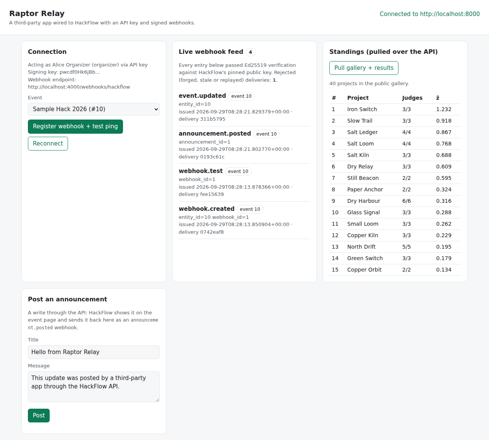

# Raptor Relay: a third-party app for HackFlow

Raptor Relay is a small, independent app that connects to a
[HackFlow](https://github.com/sarvan-2187/dog-food) portal from the outside, the way a
Discord bot, a CRM sync or a live results screen would. It shows that HackFlow is API-ready
by using the two integration points HackFlow gives outside software:

| Integration | Direction | What Raptor Relay does with it |
|---|---|---|
| **API key** (`Authorization: Bearer hf_...`) | Relay → HackFlow | Checks who the key acts as, lists events, reads the gallery and the normalized standings, registers its own webhook, and posts announcements |
| **Signed webhooks** (Ed25519) | HackFlow → Relay | Gets every audited action in an event as it happens, checks each signature against HackFlow's pinned public key, and drops forged, stale or replayed deliveries |



*The dashboard, live against a seeded HackFlow. The feed has four verified deliveries. The
fifth delivery, a forged one, was rejected and is counted as "Rejected: 1".*

**Credentials for testing the deployed third-party application:**

**User Name**: admin
**Password**: Admin@1234

It uses only the Node.js standard library (Node 20.10+): `fetch` for the API and
`node:crypto` for Ed25519. There is nothing to `npm install`.

## Quick start (about 5 minutes)

**1. Run HackFlow** (in its own repo):

```bash
git clone https://github.com/sarvan-2187/dog-food.git && cd dog-food
echo "WEBHOOK_ALLOW_PRIVATE=1" > .env   # local demo only: lets HackFlow call an app on your machine
docker compose up --build
```

`WEBHOOK_ALLOW_PRIVATE=1` is needed because HackFlow refuses to send webhooks to private or
loopback addresses by default (SSRF protection). Leave it unset on a public deployment,
where Raptor Relay will have a public URL anyway.

**2. Create an API key.** Sign in at `http://localhost:8000` as the seeded organizer
(`alice@example.com` / `organizer-pass1`), open **Integrations**, press **Create key**, name
it "Raptor Relay", and copy the `hf_...` key. It is shown only once.

**3. Configure and start Raptor Relay:**

```bash
git clone https://github.com/sarvan-2187/hackflow-third-party.git && cd hackflow-third-party
cp .env.example .env        # paste the key into HACKFLOW_API_KEY
npm start                   # dashboard on http://localhost:4000
```

In `.env`, `PUBLIC_URL` is the address HackFlow uses to reach this app. HackFlow runs inside
Docker, so on the host that address is `http://host.docker.internal:4000`. HackFlow's
`docker-compose.yml` maps that name for Linux as well.

**4. Connect them.** On the dashboard, pick an event and press **Register webhook + test
ping**. Raptor Relay subscribes itself through the API (`POST /api/events/{id}/webhooks`).
HackFlow then sends a signed `webhook.test` delivery, which shows up in the feed.

**5. Watch it work.** Do anything in HackFlow's UI: edit the event, post an announcement,
submit a project, score as a judge, run judge assignment. Each action shows up in the feed
within a second, already verified. Or press **Post** on the dashboard: that writes an
announcement through the API, and HackFlow sends it back as an `announcement.posted` webhook.

To run the same walkthrough in a terminal without the dashboard:

```bash
npm run demo    # uses the same .env
```

## How the pieces work

### Calling the API

```js
const res = await fetch(`${HACKFLOW_URL}/api/events/10/results`, {
  headers: { Authorization: `Bearer ${HACKFLOW_API_KEY}` },
});
```

A key acts as the organizer who created it, with exactly that person's role, through the same
permission checks as the web app. It can never do more than its owner could by hand.
Revoking the key, deactivating the owner or demoting them from organizer stops it at once.
HackFlow's full API reference is at `http://localhost:8000/docs`.

The API is rate-limited per key (1,200 requests a minute by default). A `429` response
carries `Retry-After`. `lib/hackflow.mjs` puts that header on the error it throws, so a
caller can wait and retry.

### Verifying a webhook (`lib/hackflow.mjs`, `verifyDelivery`)

HackFlow POSTs JSON like this:

```json
{
  "record": { "topic": "announcement.posted", "event_id": 10, "issued_at": "2026-09-29T08:28:21+00:00",
              "delivery_id": "0193c61c...", "announcement_id": 1 },
  "signature": "base64 Ed25519 signature",
  "public_key": "base64 raw public key",
  "algorithm": "ed25519"
}
```

with the headers `X-HackFlow-Topic`, `X-HackFlow-Delivery` and `User-Agent: HackFlow-Webhooks/1.0`.

A delivery is accepted only if every check passes:

1. **The signature verifies against the key this app fetched itself** from
   `GET /api/public-key` at startup. It is never checked against the `public_key` in the
   body: a forger would just put their own key there. The test suite includes that exact
   forgery.
2. **The signed bytes are HackFlow's canonical JSON**: keys sorted, no whitespace, non-ASCII
   escaped as `\uXXXX`, matching Python's `json.dumps(sort_keys=True, separators=(",", ":"))`.
   `test/fixture.json` was signed by HackFlow's own Python code, with an accented title and an
   emoji, so a mismatch would fail the tests.
3. **It is fresh**: `issued_at` is within 5 minutes.
4. **It is new**: its `delivery_id` has not been seen before, so a captured delivery can't be
   replayed.

Records carry ids and the action only, never scores, emails or vote details. To get more,
fetch it through the API with the key.

### Topics

Every action HackFlow audits is sent to the event's webhooks under the action's name.
Examples: `event.updated`, `announcement.posted`, `submission.submitted`,
`submission.disqualified`, `assignments.run`, `score.submitted`, `event.results_revealed`,
`team.created`, `comment.added`, `rubric.created`, `webhook.created`, plus `webhook.test`
from the test button. See HackFlow's `docs/USER-MANUAL.md` ("Integrations") for the full
list.

## Tests

```bash
npm test
```

The tests cover canonical-JSON compatibility with Python, verification of a real
HackFlow-signed delivery, tampering, a delivery signed with an attacker's own key, and replay
by age and by repeated delivery id.

## Files

```text
server.mjs            the app: dashboard, SSE live feed, webhook receiver, API actions
lib/hackflow.mjs      API client + canonical JSON + Ed25519 delivery verification
public/index.html     the dashboard (no framework; untrusted text is set with textContent)
scripts/demo.mjs      the same flow as a terminal walkthrough
test/                 node:test suite and a HackFlow-signed fixture
```

## Security notes

- The webhook endpoint is public by design. Its protection is the signature, not a password.
  Anything unsigned, stale or replayed gets a `401` and is counted on the dashboard.
- The dashboard and its buttons act with an organizer's key. On a shared machine or a public
  host, set `DASHBOARD_PASSWORD` (HTTP basic auth, compared in constant time).
- Request bodies over 256 KB are refused. The feed keeps the last 200 deliveries in
  `data/feed.json`, which git ignores.
- Keep `.env` out of git; it is already in `.gitignore`. If a key leaks, revoke it on
  HackFlow's Integrations page. It stops working immediately.

## License

MIT. Built by Team CodeHawk as the integration demo for HackFlow (DOGFOOD 2026).
